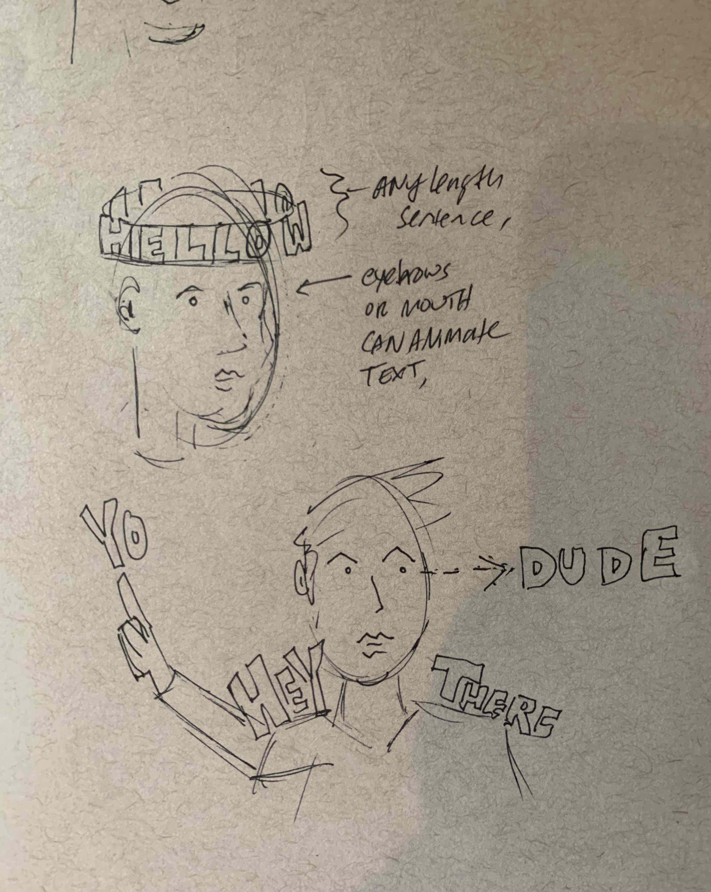

# Word Halo

Word Halo is a Tik Tok filter that lets users emote with words on their body in 3D

## Ideation
TikTok inspires me as an engine for remix and self expression and I’d like to create AR effects which could also be interpreted and extended in unthinkable ways by users.

I’m also interested in how words take on new meaning depending on how they’re displayed. We use different typefaces, layouts and font weights to add a twist, but how can we take that up a notch? Comic books nearly make words jump off the page, but could we actually bring words off of the screen and into the 3D space around us?

If so, we shouldn’t be beholden to classic static ways of displaying. My thought is to give users the agency to bring new meaning to their words in real time through dynamic state. How can we leverage tracking technologies to let them puppeteer words to give them a life of their own?

## MVP
- In its current iteration, Word Halo allows users to input text and display it as an animated halo around their head
- Users can use their eyebrows to change the text color and press a button to explode the text from their head onto the screen
- They may use it to describe what they’re thinking or feeling. Maybe what song they’re listening to or a question prompted at a friend they’re making the video for. Whatever it may be, it offers a fun and perhaps more expressive way to communicate over 2D text
- 

## How To Build
This project was built using Unity 2020.2.1 and XCode 12.2. Using different versions may cause issues. The main scene is The WordHaloMain scene located in Assets/Scenes. 

## Credit
Thank you to [Simple Helvetica](https://assetstore.unity.com/packages/tools/gui/simple-helvetica-2925) for the 3D font and to Roberto Chiaveri for this [icon](https://thenounproject.com/search/?q=exclamation&i=3601507).

Thank You :-)# Word Halo

Word Halo is a Tik Tok filter that lets users emote with words on their body in 3D

## Ideation
TikTok inspires me as an engine for remix and self expression and I’d like to create AR effects which could also be interpreted and extended in unthinkable ways by users.

I’m also interested in how words take on new meaning depending on how they’re displayed. We use different typefaces, layouts and font weights to add a twist, but how can we take that up a notch? Comic books nearly make words jump off the page, but could we actually bring words off of the screen and into the 3D space around us?

If so, we shouldn’t be beholden to classic static ways of displaying. My thought is to give users the agency to bring new meaning to their words in real time through dynamic state. How can we leverage tracking technologies to let them puppeteer words to give them a life of their own?

## MVP
- In its current iteration, Word Halo allows users to input text and display it as an animated halo around their head
- Users can use their eyebrows to change the text color and press a button to explode the text from their head onto the screen
- They may use it to describe what they’re thinking or feeling. Maybe what song they’re listening to or a question prompted at a friend they’re making the video for. Whatever it may be, it offers a fun and perhaps more expressive way to communicate over 2D text
- 
[this](https://gfycat.com/lankyunsightlyeasternnewt)

## How To Build
This project was built using Unity 2020.2.1 and XCode 12.2. Using different versions may cause issues. The main scene is The WordHaloMain scene located in Assets/Scenes. 

Thank You :-)
